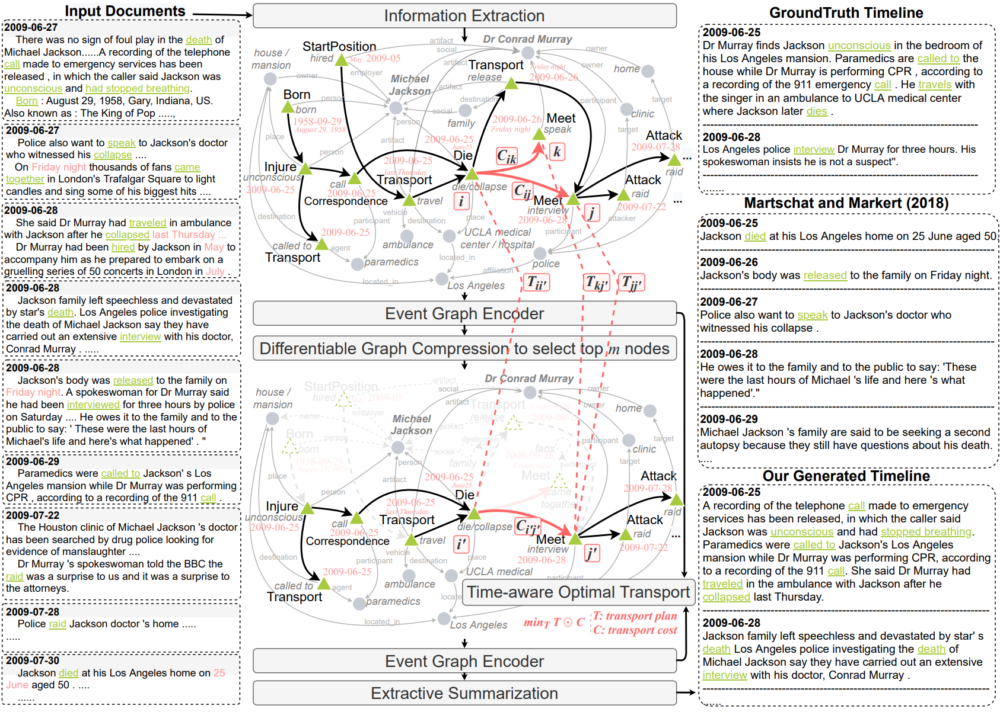

# Timeline Summarization based on Event Graph Compression via Time-Aware Optimal Transport

Table of Contents
=================
  * [Overview](#overview)
  * [Data](#data)
  * [Reference](#reference)

## Overview
Data and code for the paper ["Timeline Summarization based on Event Graph Compression via Time-Aware Optimal Transport"](https://aclanthology.org/2021.emnlp-main.519/). The code will be released soon.

<p align="center">
  
</p>


## Data
### Timeline Datasets
Please find the timeline dataset in [timeline](http://www.l3s.de/~gtran/timeline/). 

### Event Graphs extracted from the timeline datasets

Event graphs are extracted using scripts under `event_graph_construction`. Please find the event graphs in [timeline_event_graphs](https://uofi.box.com/s/juxquy21z0z9a2ckw5okvrg8ay5i7apn).

### Event Graphs from unlabeled data

1. Unlabeled data are news articles collected from Voice of American website. Please find the raw data in [voa_news](https://uofi.box.com/s/rcylt88xxjra5iyvru8g9luhrya09trh).

2. Event graphs are extracted in [voa_events](https://uofi.box.com/s/ptp10x620p6m1k3mav79ap08je9fw6fn).


## Reference
```
@article{li2021timeline,
  author    = {Manling Li and Tengfei Ma and Mo Yu and Lingfei Wu and Tian Gao and Heng Ji and Kathleen McKeown},
  title     = {Timeline Summarization based on Event Graph Compression
via Time-Aware Optimal Transport},
  journal   = {Proceedings of the 2021 Conference on Empirical Methods in Natural Language Processing},
  year      = {2021},
  url       = {https://aclanthology.org/2021.emnlp-main.519/},
}
```
